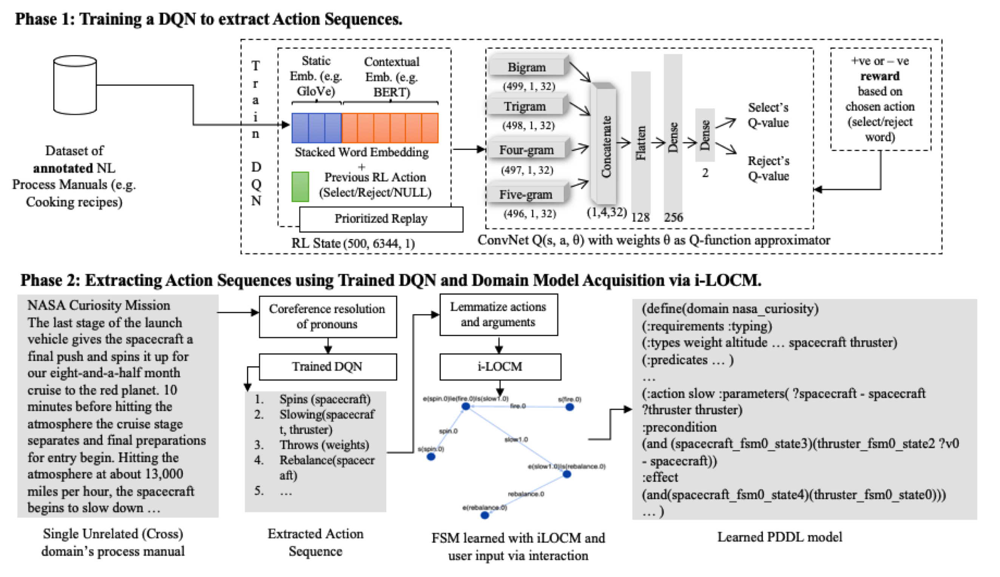

# NLtoPDDL

**Abstract:** Existing automated domain acquisition approaches require large amounts of structured data in the form of plans or plan traces to converge. Further, automatically-generated domain models can be incomplete, error-prone, and hard to understand or modify. To mitigate these issues, we take advantage of readily-available natural language data: existing process manuals. We present a domain-authoring pipeline called NLtoPDDL, which takes as input a plan written in natural language and outputs a corresponding PDDL model. We employ a two-stage approach: stage one advances the state-of-the-art in action sequence extraction by utilizing transfer learning via pre-trained contextual language models (BERT and ELMo). Stage two employs an interactive modification of an object-centric algorithm which keeps human-in-the-loop to one-shot learn a PDDL model from the extracted plan. We show that NLtoPDDL is an effective and flexible domain-authoring tool by using it to learn five real-world planning domains of varying complexities and evaluating them for their completeness, soundness and quality.

## Link to the paper
https://icaps20subpages.icaps-conference.org/wp-content/uploads/2020/10/KEPS-2020_paper_16.pdf

Errata for paper
- Figure 3: It should be DQN F2 as DQN F1 doesn't have `repeated distance` component. DQN F2 considers 100 words at a time, and not 500.

## Contextual EASDRL and LOCM2
Extracting action sequences and generating domain models.

# How to Run
- Install dependencies in requirements.txt into a new Python 3.6 virtual environment.
- Run `jupyter notebook` command from root folder. Make sure your jupyter notebook starts in the same virtual environment.
- Run the notebook called "NLtoPDDL-Example-<domain_name>.ipynb". Put in your instructions and follow along.

If you have any troubles running it, you can create an issue in this repository.

